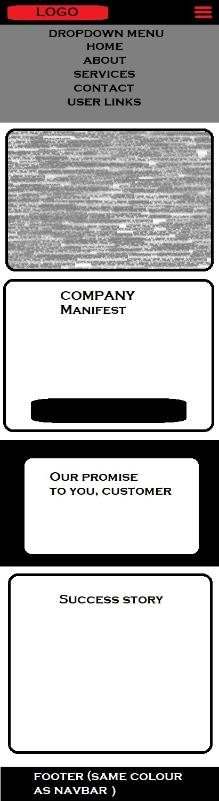

# Calling Mrs Christmas 


Calling Mrs Christmas! You haven't got the time or the energy for Christmas this year but still want to enjoy a nicely decorated tree? You want to have a Christmas party for your office, family or friends but don't know where to start? You want a lavish getaway with the people closest to you? We can help!

Cassie and her mischievous little elves have been working hard to make their clients' Christmases magical since 2013, from getting those beloved baubles down from the attic to lavish holidays to Lapland, the home of Santa himself, including a visit to the world-famous Ice Hotel. Want to see what we have to offer? Find out more at [Calling Mrs Christmas](https://callingmrschristmas.herokuapp.com)!

## UX

This website is for the (fictional) company Calling Mrs Christmas, a startup which offers Christmas-related services to its customers. The company is based in Hemel Hampstead, UK and run by Cassie Smith and her partner Jim.

### User Stories

#### Cassie Smith, CEO

- As a user, I want have an online presence, so new clients can find out more about the company.
- As a user, I want to showcase my services for potential customers, so they know the range we offer.
- As a user, I want to introduce my team to my customers, so they know they are appreciated. It's not just me on my own doing all this, you know.
- As a user, I want to keep track of orders and a calendar for when we're doing what.
- As a user, I want to be paid a deposit (10%) in advance to help with outlay: wrapping paper, transport costs etc., with the remainder to be paid on delivery.
- Nice to have: As a user, I'd like a map so users can see where our different branches are located. (Currently there's only one, but we're looking to expand so that would really future-proof the website.)
  <!--Note to self: https://pypi.org/project/django-leaflet/ to integrate Leaflet map
  Tutorial: http://blog.mathieu-leplatre.info/geodjango-maps-with-leaflet.html-->

#### Customers

##### Potential customer

- As a user, I want to know more about the company: who are they, where are they based?
- As a user, I want to see some case studies for past projects, so I can decide whether they're the right fit for what I need.
- As a user, I want to see the services on order and know in advance how much they cost.
- As a user, I want to read reviews. An average score would be helpful too in deciding whether to trust this company with my money.
- As a user, I want to be able to contact the company, either by visiting them in person or by filling out a contact form. I would expect to be emailed back by the company, but a record of past messages and their replies could be a nice addition in case mails get misplaced.

##### Current customer

- As a user, I want a clean and easy way to make a booking for services. A calendar where I can see which dates are still available would be helpful.
- As a user, I want to keep track of my order. (Nice to have: a reminder when Calling Mrs Christmas will be providing the booked services.)

##### Past customer

- As a user, I want to leave a review for Cassie and her team.

### Layout

The original inspiration for the lay-out, and also part of the source code, was the [Business Casual Start Bootstrap template](https://startbootstrap.com/themes/business-casual/). As you can see in the link, this was originally made for a coffee shop, but changing to a more christmassy colour theme and replacing the images went a long way to getting the layout for this project as I wanted it.

#### Why I chose to use this template

1. I liked the way the content had a bit of overlay on the images.
1. I liked the way different pages had different build-up and alternating formatting of the sections.
1. I liked the opening hours script that marks out the current day.

#### What I changed to make it mine

1. As detailed above, I changed the colour scheme from dark browns and ochre yellow to red, green and white for a more christmassy look. Exact hex values used:
   - Green: `#477d55`
   - Dark Green: `#5e8c6a`
   - White: `#fefdfb`
   - Red: `#b43858`
1. Images replaced by Christmas-themed images from Pexels and other sources, see [Media section](#media).
1. Add a countdown to Christmas in the footer.
1. Make the pages dynamic Django templates rather than hardcoded plain HTML pages.

### Wireframes

Wireframes were created in Paint. I've included the wireframes for the homepage on different screen sizes here in the README. You can find the others in the [wireframes folder](wireframes).

#### Mobile Phone (portrait mode)



#### Mobile Phone (landscape mode), Tablet (portrait mode)


#### Tablet (landscape mode), Large Tablet, Laptop, Desktop


## Features

### Existing Features

For the sake of clarity, I've chosen to document features per app. Apps may have access to models belonging to other apps to make the site work properly, but here you'll find exactly which features, templates and general code belong to which app.

#### Project-wide features

- The [static](static) folder does exactly what it says: it holds the static files. As such it contains:
  - Images that are not uploaded by a user
  - CSS files:
    - [Imported styles from the StartBootstrap template](static/css/business-casual.min.css)
    - [Custom styles for this website](static/css/style.css)
  - JavaScript files:
    - [Stripe.js](static/js/stripe.js) which is refered to in the checkout template to provide payment functionality
    - [Script.js](static/js/script.js) is added to the bottom of the base template body. It holds the script for the Christmas Countdown in the footer as well as the one to activate the tooltips for any helptext in forms.
- [Templates](templates) at the project's base level holds one file only: the [Base Template](templates/base.html) which is extended with all other templates. This holds the content that is visible on every single page of the website. This includes:

  - The header (larger screens only)
  - The navbar, which is fixed so it scrolls along til it gets to the top of the viewport and then stays visible. It collapses on mobile screens, showing the company logo and a burger icon to extend the menu. The sticky positioning for the navbar is done with the following CSS:

  ```css
  #mainNav {
    position: -webkit-sticky; /* Safari */
    position: sticky;
    top: 0;
    z-index: 3;
  }
  ```

  - The footer, which contains copyright and, on bigger screens, more information to the left as well as the Christmas Countdown clock to the right. This always stays at the bottom of the page content. In case there's not enough content on a page, it stays at the bottom of the viewport using the following css:

  ```css
  body {
    min-height: 100vh;
    position: relative;
    padding-bottom: 7rem;
  }

  footer.footer {
    width: 100%;
    position: absolute;
    bottom: 0;
  }
  ```

#### About

This app contains everything about the company. As such, it houses the models for Employee and Case Study. It also contains the templates and views for:

- The Home page, which contains the company manifest with a Book Now button redirecting the user to Services, Our Promise To You and a randomly selected case study under the heading Success Story, with a More Like This button linking to the Success Stories page that lists all of them.
- The About page, which gives the user a bit more information about the company's history and staff members. Clicking or tapping a staff member's card will bring the user to their respective introduction page.
- The Staffmember Introduction page. This shows a user the respective staff member's profile image, name, title and a short introduction.
- The Casestudies page which shows off all our success stories, not just the one randomly selected one on the home page.

#### Accounts

As the name says, this app deals with everything account-related. As such, it houses the login, register, logout and profile functionality as well as the urls and templates for password reset. Features for this app:

- Register: allows users to create an account. Fields on the form: - username (this has to be unique) - email (this has to be unique) - first name - last name - password - password confirmation (has to be equal to password)
- Login: allows users to log into their account with their email or username and their chosen password. Fields on the form: - Username/email - Password
- Profile: this page brings together everything related to the current user in one place: - past purchases (from Order model in checkout app) - sent messages and the replies to them - account details (listed, not editable) - contact details (editable form). Logging in is mandatory so users cannot change each other's details.
- Logout: clicking or tapping this item on the dropdown menu in the navbar will log a user out and redirect them to the main page with a message to tell them "Thank you for visiting".
- Password reset functionality (built into Django, but I've extended the templates to match the rest of the site)

It's also where the model for Contact Details and the accompanying form are housed so contact details can be saved by a user.

#### Services

This is where the services are showcased. This app contains two models: Service and ServiceCategory. It also contains the templates and views for:

- Services, which shows the different service categories
- Services by category, which shows the different services within one selected category
- Service detail, which shows the chosen service in more detail, with a longer description

Services can be booked by filling in quantity and clicking the Add to Cart button on the services by category page as well as the service detail page.

#### Cart

This app provides the Cart model which allows a signed in user to keep their cart between sessions. This is very important given that Heroku's dynos shut down after a set period of inactivity. A user who chooses not to log in, will not be able to save their cart between sessions.

It only contains one page, the Cart page, where a user can review their items, adjust quantity if needed, remove an item by putting quantity to 0, see their current total and choose (by clicking a button) to either continue shopping or go to checkout.

#### Checkout

This app also only contains one page, the checkout page which allows the user to pay a deposit for their booked services.

It also contains two models:

- Order: contains the order-related data:
  - Delivery address
  - Date of booking
- Order Line Item: contains one service booked for this order and its quantity. Multiple per order allowed.

#### Contact

This app contains the contact information for the company. It has two models:

- Location: allows the staff to add more locations if the company expands. Currently only has one instance which is the head office. In case the head office instance accidentally gets deleted, this info is set to load as default when creating a new instance of the model.
- Contact Message: This model will save the messages sent by users so the staff can respond to them. It's also connected to the User Profile page where a user can see their messages, provided they were logged in at the time of sending it.

The contact page itself has three sections:

- A contact form where the user can send their message
- The address details for every location (currently, only the head office)
- The opening hours with a script to mark the current day (adapted from the original Business Casual template)

### Features Left to Implement

- Add a calendar to the bookings so customers can see which dates Calling Mrs Christmas is available and can book a date that suits them rather than getting a call to arrange the date.
- Add a map to the contact page so users can see where the office is located and get directions.
- Add a way for users to leave and read reviews and ratings.

## Technologies Used

### Languages

- [Python](https://www.python.org/)
  - The main language used for this project is Python, in which all the backend functionality (accessing the database, rendering templates, creating models and forms) is written.
- [JavaScript](https://www.javascript.com/)
  - JavaScript was used for the Christmas countdown (see [Christmas Countdown script](static/js/script.js))
  - JavaScript was also added in the same script file to activate Bootstrap tooltips.
  - The Stripe payment API also works through the addition of a JS file: [stripe.js](static/js/stripe.js), as well as an embedded script in the [checkout page](checkout/templates/checkout.html) to pass the Stripe publishable key from the backend (where it's saved as an environment variable) to the frontend as a templating variable so the stripe.js file can access it.
- [HTML](https://www.w3.org/html/)
  - The main language used to display content on the web, therefore also on this website. All of the templates were written in HTML.
- [CSS](https://www.w3.org/Style/CSS/)
  - Cascading Style Sheets are where the style of the website comes alive. This is where background images are set, colour schemes and fonts are applied to different elements on the page and media queries provide further responsiveness than the standard Bootstrap Grid.
- [Markdown](https://commonmark.org/help)
  - This final language was used to create the very document you're reading right now. To see the actual Markdown syntax, check the [Raw version](https://raw.githubusercontent.com/Wings30306/callingmrschristmas/master/README.md)

### Frameworks

- [Django](https://www.djangoproject.com/)
  - The Python framework used for this project is Django. This comes with a lot of functionality out of the box, for example:
    - User authentication: Django has user authentication out of the box. I did expand upon this to include a password confirmation check and linked it up to my own templates.
    - Password reset
    - Admin: This allows staff (and ONLY staff) to see non-styled pages (i.e. with standard Django styling) where they can check orders, reply to messages, update their own profile, update the location information...
- [Bootstrap](https://getbootstrap.com/):
  - The Bootstrap framework was used to help with template layout:
    - the Bootstrap grid is very helpful in terms of mobile-first development. One example I used in the project is to use the d-none class on the header to hide it on mobile screens so it doesn't take up unnecessary real-estate, then use d-md-block to display it on medium to large screens.
    - Bootstrap also needed to be added for the template I used to work, as that is itself a [StartBootstrap](https://startbootstrap.com/) template which applies Bootstrap styles.

### Libraries and APIs

- [jQuery](https://jquery.com/)
  - The main reason for jQuery to have been added in this project is to allow simplification of the js files and most importantly to allow the Bootstrap Javascript script to do its job
- [Stripe API](https://stripe.com)
  - The Stripe API was used to allow payment functionality. It's set to accept [Stripe test cards](https://stripe.com/docs/testing) only as per the requirements of the course.

### Database

- [PostgreSQL](https://www.postgresql.org/)
  - PostgreSQL was used to create the database for this project, as it's available as a Heroku Plug-In. See [Deployment](#deployment) for more details.

### Other Resources

- [Font Awesome](https://fontawesome.com/) was used for the icons in this website, for example for the cart and user in the navbar and on some of the buttons.
- Fonts for the text in this project came from [Google Fonts](https://fonts.google.com/). The specific fonts used are [Lora](https://fonts.google.com/specimen/Lora), the main font used throughout the site, and [Raleway](https://fonts.google.com/specimen/Raleway) which is used for the larger font in the headings. Both were used in the original template and refered to in the page head - I've moved them instead to be imported in the [Business Casual CSS file](static/css/business-casual.min.css).

## Testing

1. This project does not have automated testing.
1. The build for the project is tested by [Travis CI](http://travis-ci.org/) automatically after each push.
1. Most of the testing was done manually by myself during development: build a feature, test it.
1. Before submitting, this project was also posted in the Slack workspace for Code Institute, in the Peer Code Review channel. If you have access to it, you're welcome to check the [thread](https://code-institute-room.slack.com/archives/CGWQJQKC5/p1580334173051400). A huge thanks to testers [Duncan](https://github.com/ddeveloper72/), [Libby](http://github.com/LibbyH52), [Edel](https://github.com/coderbeez), [Paul](https://github.com/Spagettileg) and [Anthony](https://github.com/auxfuse) for taking the time to help me with this. Bugs found and fixed thanks to their help:

    1. Deleting an item from cart did not work for non-logged in users. This was due to the session cart not being updated, only the Cart instance for logged in users.
    1. Fixing the above bug meant items could get deleted from cart, but it caused a bug with updating the quantity. This affected all users. It was caused by an oversight with the new_cart variable used to update the cart after removing the item in the "if quantity == 0" part of the function.
    1. Message after updating contact details wasn't showing. This was because I simply forgot to add it. It has been added now for a better user experience.
    1. Missing error pages. Hadn't noticed because debug had been left on accidentally. Debug is now turned off and custom error pages have been added. Let Santa help you get back home! [Demo for 404 page](https://callingmrschristmas.herokuapp.com/404)
    1. Misaligned paragraph showing if a user didn't have orders yet. This was due to the row not having any padding. Padding has been added, it now lines up nicely with the paragraph above.

1. To view the default Django admin pages (only accessible to staffmembers) and check whether a new instance to a model has been added through the forms, please log in to [ADMIN area](https://callingmrschristmas.herokuapp.com/admin/) as **rozzer** with password **merryXmas**. (Permissions backstory: Andrew is a staffmember who isn't quite confident around computers, so he can only view items in the admin but not edit or delete them. This account can therefore be used for viewing the instances in models by a tester or an assessor while still preserving the defensive programming that's in place.)

### Known Bugs

The following bugs were found by fellow students in Code Institute's Slack workspace (see previous section) during testing but not fixed due to lack of time:

- Phone field accepts all characters. This is because the model saves it as a CharField. Django does not have a built-in form field for phone numbers. To be corrected later with a PyPI library (there are a few options but I've not yet found one I could get to work in the time I had left). A suggestion was to make it an IntegerField instead, but I thought it better to save as a string in case a user wants to use special characters or spaces to match their local phone number format.
- The redirect to profile after registering doesn't appear to work on certain mobiles, notably Samsung Galaxy S8+.
- The non-breaking dash between the copyright years in the footer looks like an underscore on certain mobiles, notably a Motorola MotoG4. It's also fairly low on a Sony Experia, but not quite as low as an underscore.

## Deployment

This project is hosted on [Heroku](https://heroku.com). It's been deployed using the following steps:

1. In the terminal, run `python manage.py collectstatic` to collect static files for deployment on Heroku.
1. Pip install whitenoise.
1. Add `'whitenoise.middleware.WhiteNoiseMiddleware'` in the MIDDLEWARE section of your [settings](callingmrschristmas/settings.py) file.
1. Sign up (new user) or sign in to Heroku account. _I already had an account from previous projects, so only needed to sign in._
1. Click the button at the top right that says "New", select "Create new app" in the dropdown.
1. Choose an app name. **Caution! This must be unique!**
1. Select your region. _In my case, this is Europe._
1. You'll be redirected to the Deploy tab of the new app.
1. Go to Deployment method. Select your prefered deployment method. _As my code was already on Github, I chose the "Connect to Github" option. The following steps will be specific to this option._
1. Sign in to your Github account to allow Heroku access to repositories.
1. Search for your repo name. If you can't remember the specific spelling of the name, leave the input field blank and click "Search" to get a list of all your repos.
1. When you've found your repo in the list, click the "Connect" button.
1. You now have the choice to enable automatic deploys or deploy manually. _This project uses automated deployment_
1. Your project will need to contain the following in order for Heroku to deploy it:

    - A Procfile: this specifies the commands that are executed by the app on startup. You can use a Procfile to declare a variety of process types, including:

        - Your app’s web server
        - Multiple types of worker processes
        - A singleton process, such as a clock
        - Tasks to run before a new release is deployed.

      _In the case of this project, the Procfile contains only a single line:_

      ```yml
      web: gunicorn callingmrschristmas.wsgi:application
      ```

      _To allow this to run, gunicorn was added to the [requirements](requirements.txt)_

    - A requirements.txt file. This tells Heroku which dependencies need to be installed in order for the project to run. It's created by using the command `pip install` + the name of any dependencies you have (for example, Flask needs to be installed for this project) in the terminal of your prefered editor, followed by the command `pip freeze > requirements.txt` which will write the installed dependencies to a text file which Heroku then installs using `pip install requirements.txt`.

1. Add a PostgreSQL database Plug-In. This will generate a database url in the Config vars.
1. Go to settings in the Heroku tab. Click "Reveal Config Vars". Add the relevant environment variables you've used in your project to the Config Vars so Heroku can access them. Specifically, for this particular project, that means the following Config Vars were added:
   - DATABASE_URL (for PostgreSQL as detailed in the previous step)
   - DEBUG (set to 0 to turn off Debug mode in the deployed version. Locally, in development, this variable was set to 1.)
   - EMAIL_ADDRESS (for allowing password reset emails to be sent)
   - EMAIL_PASSWORD (App password generated with two-step authentication)
   - HOSTNAME (required for Django projects. Set to "0.0.0.0." for local development, "callingmrschristmas.herokuapp.com" in deployment)
   - SECRET_KEY (required for Django projects, generated with the [Django Secret Key Generator](https://miniwebtool.com/django-secret-key-generator/))
   - STRIPE_PUBLISHABLE_KEY (to be passed in to the [stripe](stripe.js) file in the [checkout template](checkout/templates/checkout.html))
   - STRIPE_SECRET_KEY (to be passed to [checkout views](checkout/views.py))
1. Check the activity tab. The two most recent items in the list should read "Deployed" and "Build Succeeded" in their status.
1. Click "Open App" in the top right side if this is the case, this will take you to the live site of the [Project](https://callingmrschristmas.herokuapp.com/).

### To run this project locally

1. Clone the [Github repo](https://github.com/wings30306/callingmrschristmas) using the green "Clone or download" button. Several options are available here.
1. Open the project in your prefered editor.
1. Create a virtual environment using the command `python -m venv envname`, replacing "envname" with the name you want to give this environment. ([More information on virtual environments](https://docs.python.org/3/library/venv.html))
1. Open the virtual environment:
   - Windows Cmd Shell: `<envname>\Scripts\Activate`
   - Posix/Linux bash Shell:
     `$ source <envname>/bin/activate`
1. Install the dependencies using the command `pip install -r requirements.txt`
1. Set up environment variables. There are different ways to do this depending on your system and/or editor. In my editor of choice, VS Code running on Windows, you can do this in the .vscode directory that's generated for every project. This will contain a settings.json file. Add the environment variables as detailed in the Config Vars of the deployment section to the json dictionary, for example:

   ```json
   "terminal.integrated.env.windows":
   {
       "SECRET_KEY": "YourSecretKeyHere"
   },
   ```

1. Run the project in your terminal using the command `python manage.py runserver` (like pip, for Unix-based systems you may need to use `python3`).

## Credits

### Content

- The staff names and success stories were taken (and paraphrased) from the book "Calling Mrs Christmas" by Carole Matthews.

### Media

- The following images were obtained from Pexels:

  - Background: [Photo by Giftpundits.com](https://www.pexels.com/photo/red-white-and-brown-gift-boxes-1303081/)
  - Intro: [Photo by Thanakorn Phanthura](https://www.pexels.com/photo/man-and-woman-standing-beside-christmas-tree-3183385/)
  - About: [Photo by Oleg Magni](https://www.pexels.com/photo/green-christmas-tree-with-baubles-1762887/)
  - Team: [Photo by fauxels](https://www.pexels.com/photo/photo-of-people-leaning-on-wooden-table-3184325/)
  - Dog sledding (case study: Lavish Lapland Luxury and Little Gaddesden Gaiety): [Photo by Lars Ley](https://www.pexels.com/photo/sled-pulled-by-dogs-2531014/)
  - Wrapping (service category): [Photo by Pixabay](https://www.pexels.com/photo/gift-wrap-paper-wrapping-paper-gift-present-12553/)
  - Catering (service category): [Photo by picjumbo.com](https://www.pexels.com/photo/blur-bokeh-candle-christmas-decoration-196648/)
  - Gift-shopping (service category): [Photo by freestocks.org](https://www.pexels.com/photo/paper-bags-near-wall-749353/)
  - Decorating (service category): [Photo by Toni Cuenca](https://www.pexels.com/photo/green-christmas-tree-688573/)
  - Brown paper packages tied up with string (service): [Photo by Ylanite Koppens](https://www.pexels.com/photo/photo-of-two-brown-wrapped-gifts-on-wooden-table-1693650/)
  - Wrapping gifts for adults (service): [Photo by Pixabay](https://www.pexels.com/photo/advent-balls-celebration-christmas-264742/)
  - Wrapping gifts for children (service): [Photo by cottonbro](https://www.pexels.com/photo/photo-of-girl-sitting-on-white-sofa-with-her-legs-crossed-holding-present-3154345/)
  - Tree Delivery: [Photo by Dids](https://www.pexels.com/photo/shallow-focus-photography-of-green-coniferous-tree-2456348/)
  - Tree Decorating: [Photo by cottonbro](https://www.pexels.com/photo/two-girls-putting-decorations-on-a-christmas-tree-3154322/)
  - Decorations for Rent: [Photo By Paola L](https://www.pexels.com/photo/gray-blue-and-gold-colored-baubles-790155/)
  - Error page image: [Photo by bruce mars](https://www.pexels.com/photo/man-in-santa-claus-costume-716658/)

- Images not from Pexels:

  - Staff profile images created on [Cartoonify](https://www.cartoonify.de/)
  - A room at the Ice Hotel (case study: Lavish Lapland Luxury and Little Gaddesden Gaiety): [Photo by By Stephan Herz (User:Stephan_Herz) - Own work, CC BY 2.5 on Wikipedia](https://commons.wikimedia.org/w/index.php?curid=485145)
  - Telephone horn in logo found on [PNG Guru](https://www.pngguru.com/free-transparent-background-png-clipart-vhzzo)
  - Full logo created by [Sean Murphy](https://github.com/nazarja)
  - Favicon image created by [Guillermo Brachetta](https://github.com/GBrachetta) and converted using [Favicon Converter](https://favicon.io/favicon-converter/)

### Code-related acknowledgements

- Christmas countdown clock adjusted from [Days Until Christmas](https://www.days-until-christmas.co.uk/website-xmas-countdown.htm). Clock style 1 was used for a combination of relatively small size to fit into footer and readability/accessibility. Originally, I had chosen clock style 1, but it turned out that was hard to read for people with green/red colour blindness. Pointed out by [Bim Williams](https://github.com/MrBim)
- Code used or adapted from Code Institute lessons:
  - Stripe.js used as shown in e-commerce mini project (Code Institute) for (test) payment functionality
  - .travis.yml file used as shown in e-commerce mini-project (Code Institute) for TravisCI.
- Code from other tutorials:
  - [Django 2 Tutorial by codingforentrepreneurs](https://www.youtube.com/watch?v=F5mRW0jo-U4) was used to learn about the differences between Django 1 (shown in Code Institute lessons) and the current long-term support version of Django 2. Main differences I learned about through this tutorial:
    - urls.py now uses path instead of url and no longer needs regex build-up of urls
    - classbased views can help speed up development, but may need overriding of template names, success urls etc.
  - [How To Use Bootstrap 4 in Django Forms](https://simpleit.rocks/python/django/forms/how-to-use-bootstrap-4-in-django-forms/) was recommended by [Simen Daehlin](https://github.com/Eventyret) to allow Bootstrap classes to be used on Django Forms.

### Acknowledgements

- Thank you to the fabulous [Carole Matthews](https://www.carolematthews.com/), author of the book [Calling Mrs Christmas](https://www.carolematthews.com/books/calling-mrs-christmas/), without whose wonderful story and kind permission this project would not have happened.
- Thank you to my amazing mentor and friend [Simen Daehlin](https://github.com/Eventyret) aka Yoda. Your padawan is now a jedi. Couldn't have got here without you, mate! Thanks for putting up with my panic moments, too!
- Thank you to the CodeBantz crew (you know who you are) for the encouragement, the pinpoints in the right direction when I felt lost, and the laughs we had along the way!
- Thank you to the Code Institute staff and Slack community, new and old. Final project! This is what makes all the struggles worthwhile!
- To everyone I forgot to mention (we all know what my memory is like), I'm sorry and thank you!
