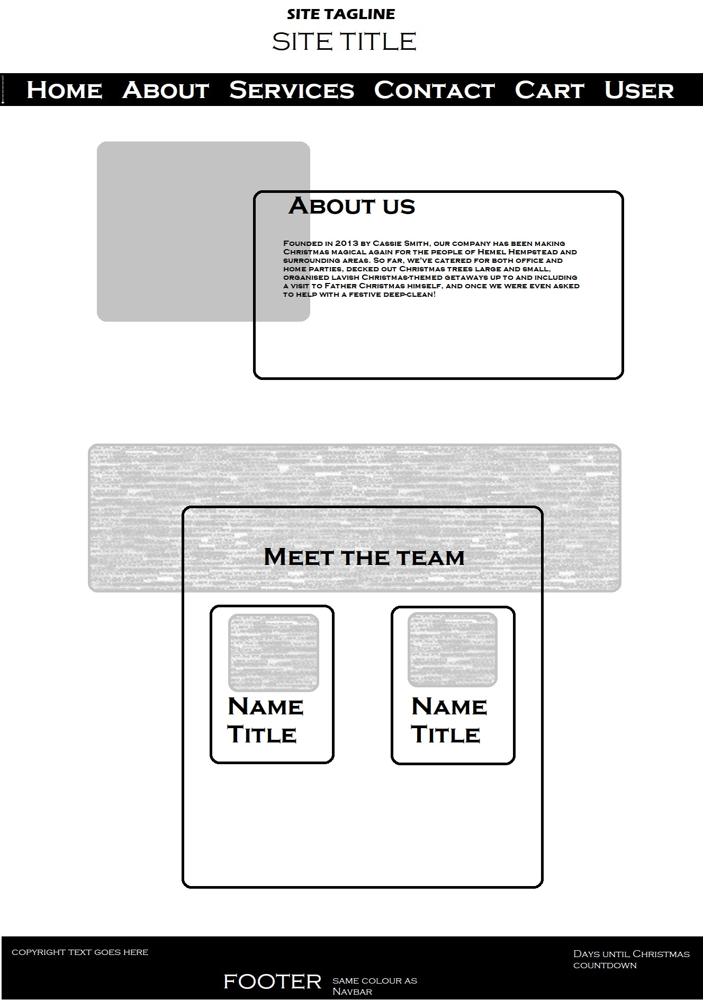
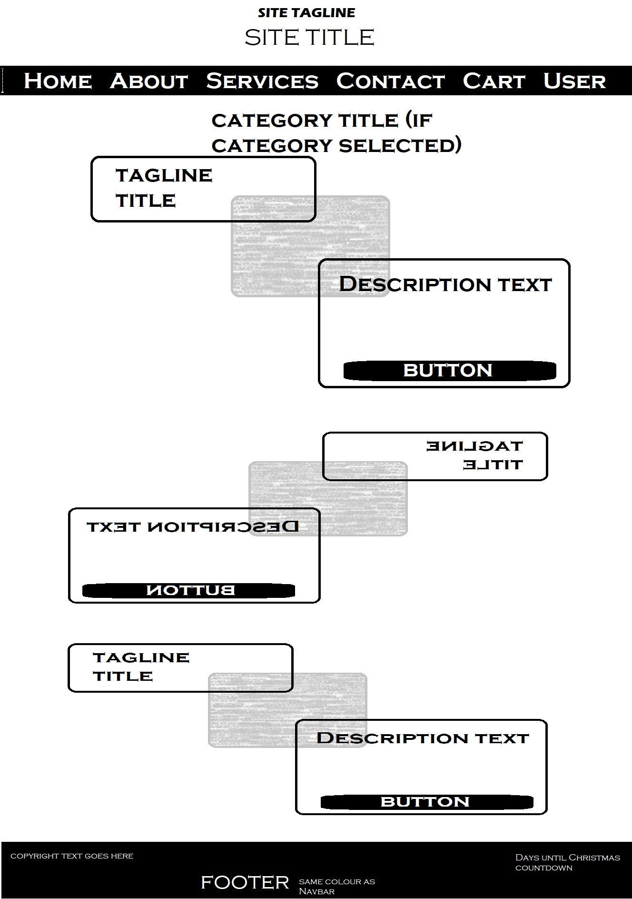
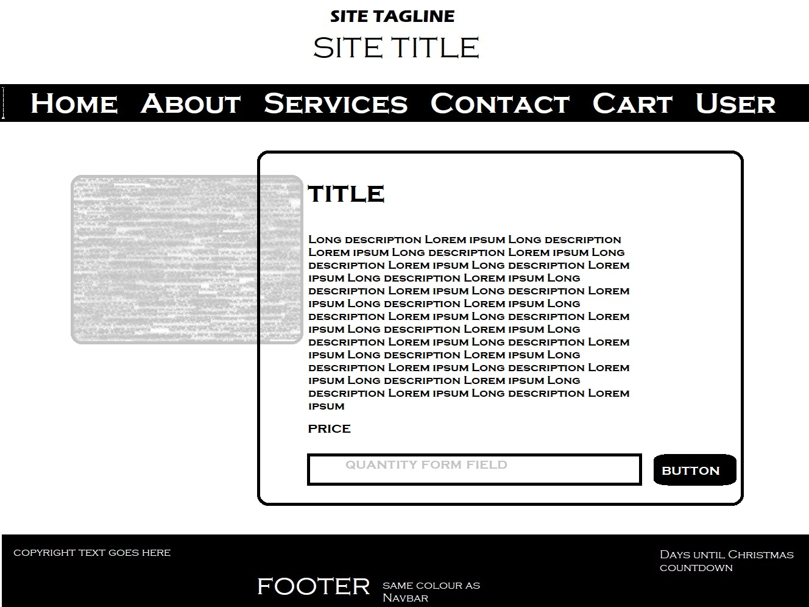

# Calling Mrs Christmas

Calling Mrs Christmas! You haven't got the time or the energy for Christmas this year but still want to enjoy a nicely decorated tree? You want to have a Christmas party for your office, family or friends but don't know where to start? You want a lavish getaway with the people closest to you? We can help!

Cassie and her mischievous little elves have been working hard to make their clients' Christmases magical since 2013, from getting those beloved baubles down from the attic to lavish holidays to Lapland, the home of Santa himself, including a visit to the world-famous Ice Hotel. Want to see what we have to offer? Find out more at [Calling Mrs Christmas](https://callingmrschristmas.herokuapp.com)!

Current build continuous integration status: 

## UX

This website is for the (fictional) company Calling Mrs Christmas, a startup which offers Christmas-related services to its customers. The company is based in Hemel Hampstead, UK and run by Cassie Smith and her partner Jim.

### User Stories

#### Cassie Smith, CEO

- As a user, I want have an online presence, so new clients can find out more about the company.
- As a user, I want to showcase my services for potential customers, so they know the range we offer.
- As a user, I want to introduce my team to my customers, so they know they are appreciated. It's not just me on my own doing all this, you know.
- As a user, I want to keep track of orders and a calendar for when we're doing what.
- As a user, I want to be paid a deposit (10%) in advance to help with outlay: wrapping paper, transport costs etc., with the remainder to be paid on delivery.
- Nice to have: As a user, I'd like a map so users can see where our different branches are located. (Currently there's only one, but we're looking to expand so that would really future-proof the website.)
  <!--Note to self: https://pypi.org/project/django-leaflet/ to integrate Leaflet map
  Tutorial: http://blog.mathieu-leplatre.info/geodjango-maps-with-leaflet.html-->

#### Customers

##### Potential customer

- As a user, I want to know more about the company: who are they, where are they based?
- As a user, I want to see some case studies for past projects, so I can decide whether they're the right fit for what I need.
- As a user, I want to see the services on order and know in advance how much they cost.
- As a user, I want to read reviews. An average score would be helpful too in deciding whether to trust this company with my money.
- As a user, I want to be able to contact the company, either by visiting them in person or by filling out a contact form. I would expect to be emailed back by the company, but a record of past messages and their replies could be a nice addition in case mails get misplaced.

##### Current customer

- As a user, I want a clean and easy way to make a booking for services. A calendar where I can see which dates are still available would be helpful.
- As a user, I want to keep track of my order. (Nice to have: a reminder when Calling Mrs Christmas will be providing the booked services.)

##### Past customer

- As a user, I want to leave a review for Cassie and her team.

### Layout

The original inspiration for the lay-out, and also part of the source code, was the [Business Casual Start Bootstrap template](https://startbootstrap.com/themes/business-casual/). As you can see in the link, this was originally made for a coffee shop, but changing to a more christmassy colour theme and replacing the images went a long way to getting the layout for this project as I wanted it.

#### Why I chose to use this template

1. I liked the way the content had a bit of overlay on the images.
1. I liked the way different pages had different build-up and alternating formatting of the sections.
1. I liked the opening hours script that marks out the current day.

#### What I changed to make it mine

1. As detailed above, I changed the colour scheme from dark browns and ochre yellow to red, green and white for a more christmassy look. Exact hex values used:
   - Green: `#477d55`
   - Dark Green: `#5e8c6a`
   - White: `#fefdfb`
   - Red: `#b43858`
1. Images replaced by Christmas-themed images from Pexels and other sources, see [Media section](#media).
1. Add a countdown to Christmas in the footer.
1. Make the pages dynamic Django templates rather than hardcoded plain HTML pages.

#### Wireframes

Wireframes were created in Paint to speed up creating them.
The following wireframes were used:

##### Mobile

To be added

##### Tablet

To be added

##### Desktop

1. Home page:
   
1. About page:
   
1. Services & Services by Category pages:
   
1. Service detail page and staffmember page:
   
1. Cart page:
   

## Features

### Existing Features

For the sake of clarity, I've chosen to document features per app. Apps may have access to models belonging to other apps to make the site work properly, but here you'll find exactly which features, templates and general code belong to which app.

#### Project-wide features

- the [static](static) folder does exactly what it says: it holds the static files. As such it contains:
  - images that are not uploaded by a user
  - css files:
    - [imported styles from the StartBootstrap template](static/css/business-casual.min.css)
    - [custom styles for this website](static/css/style.css)
  - js files:
    - [stripe.js](static/js/stripe.js) which is refered to in the checkout template to provide payment functionality
    - [christmas-countdown.js](static/js/christmas-countdown.js) is added to the bottom of the base template body. It holds the script for the Christmas Countdown in the footer as well as the one to activate the tooltips for any helptext in forms.
- [Templates](templates) at the project's base level holds one file only: the [Base Template](templates/base.html) which is extended with all other templates. This holds the content that is visible on every single page of the website. This includes:

  - the header (larger screens only)
  - the navbar, which is fixed so it scrolls along til it gets to the top of the viewport and then stays visible. It collapses on mobile screens, showing the company logo and a burger icon to extend the menu. The sticky positioning for the navbar is done with the following CSS:

  ```css
  #mainNav {
    position: -webkit-sticky; /* Safari */
    position: sticky;
    top: 0;
    z-index: 3;
  }
  ```

  - the footer, which contains copyright and, on bigger screens, more information to the left as well as the Christmas Countdown clock to the right. This always stays at the bottom of the page content. In case there's not enough content on a page, it stays at the bottom of the viewport using the following css:

  ```css
  body {
    min-height: 100vh;
    position: relative;
    padding-bottom: 7rem;
  }

  footer.footer {
    width: 100%;
    position: absolute;
    bottom: 0;
  }
  ```

#### About

This app contains everything about the company. As such, it houses the models for Employee and Case Study. It also contains the templates and views for:

- the home page, which contains the company manifest with a Book Now button redirecting the user to Services, Our Promise To You and a randomly selected case study under the heading Success Story, with a More Like This button linking to the Success Stories page that lists all of them.
- the About page, which gives the user a bit more information about the company's history and staff members. Clicking or tapping a staff member's card will bring the user to their respective introduction page.
- the staff member introduction page. This shows a user the respective staff member's profile image, name, title and a short introduction.
- the casestudies page which shows off all our success stories, not just the one randomly selected one on the home page.

#### Accounts

As the name says, this app deals with everything account-related. As such, it houses the login, register, logout and profile functionality as well as the urls and templates for password reset. Features for this app:

- register: allows users to create an account. Fields on the form: - username (this has to be unique) - email (this has to be unique) - first name - last name - password - password confirmation (has to be equal to password)
- login: allows users to log into their account with their email or username and their chosen password. Fields on the form: - Username/email - Password
- profile: this page brings together everything related to the current user in one place: - past purchases (from Order model in checkout app) - sent messages and the replies to them - account details (listed, not editable) - contact details (editable form)
- logout: clicking or tapping this item on the dropdown menu in the navbar will log a user out and redirect them to the main page with a message to tell them "Thank you for visiting".

#### Services

This is where the services are showcased. This app contains two models: Service and ServiceCategory. It also contains the templates and views for:

- Services, which shows the different service categories
- Services by category, which shows the different services within one selected category
- Service detail, which shows the chosen service in more detail, with a longer description

Services can be booked by filling in quantity and clicking the Add to Cart button on both services by category and service detail pages.

### Features Left to Implement

- Add a calendar to the bookings so customers can see which dates Calling Mrs Christmas is available and can book a date that suits them rather than getting a call to arrange the date.
- Add a map to the contact page so users can see where the office is located and get directions.
- Add a way for users to leave and read reviews and ratings.

## Technologies Used

### Languages

- [Python](https://www.python.org/)
  - The main language used for this project is Python, in which all the backend functionality (accessing the database, rendering templates, creating models and forms) is written.
- [JavaScript](https://www.javascript.com/)
  - JavaScript was used for the Christmas countdown (see [Christmas Countdown script](static/js/christmas-countdown.js))
  - JavaScript was also added in the same script file to activate Bootstrap tooltips.
  - The Stripe payment API also works through the addition of a JS file: [stripe.js](static/js/stripe.js), as well as an embedded script in the [checkout page](checkout/templates/checkout.html) to pass the Stripe publishable key from the backend (where it's saved as an environment variable) to the frontend as a templating variable so the stripe.js file can access it.
- [HTML](https://www.w3.org/html/)
  - The main language used to display content on the web, therefore also on this website. All of the templates were written in HTML.
- [CSS](https://www.w3.org/Style/CSS/)
  - Cascading Style Sheets are where the style of the website comes alive. This is where background images are set, colour schemes and fonts are applied to different elements on the page and media queries provide further responsiveness than the standard Bootstrap Grid.
- [Markdown](https://commonmark.org/help)
  - This final language was used to create the very document you're reading right now. To see the actual Markdown syntax, check the [Raw version](https://raw.githubusercontent.com/Wings30306/callingmrschristmas/master/README.md)

### Frameworks

- [Django](https://www.djangoproject.com/)
  - The Python framework used for this project is Django. This comes with a lot of functionality out of the box, for example:
    - user authentication: Django has user authentication out of the box. I did expand upon this to include a password confirmation check and linked it up to my own templates.
    - admin: This allows staff (and ONLY staff) to see non-styled pages (i.e. with standard Django styling) where they can check orders, reply to messages, update their own profile, update the location information...
- [Bootstrap](https://getbootstrap.com/):
  - The Bootstrap framework was used to help with template layout:
    - the Bootstrap grid is very helpful in terms of mobile-first development. One example I used in the project is to use the d-none class on the header to hide it on mobile screens so it doesn't take up unnecessary real-estate, then use d-md-block to display it on medium to large screens.
    - Bootstrap also needed to be added for the template I used to work, as that is itself a [StartBootstrap](https://startbootstrap.com/) template which applies Bootstrap styles.

### Libraries and APIs

- [jQuery](https://jquery.com/)
  - The main reason for jQuery to have been added in this project is to allow simplification of the js files and most importantly to allow the Bootstrap Javascript script to do its job
- [Stripe API](https://stripe.com)
  - The Stripe API was used to allow payment functionality. It's set to accept [Stripe test cards](https://stripe.com/docs/testing) only as per the requirements of the course.

### Database

- [PostgreSQL](https://www.postgresql.org/)
  - PostgreSQL was used to create the database for this project, as it's available as a Heroku Plug-In. See [Deployment](#deployment) for more details.

<!--
## Testing

In this section, you need to convince the assessor that you have conducted enough testing to legitimately believe that the site works well. Essentially, in this part you will want to go over all of your user stories from the UX section and ensure that they all work as intended, with the project providing an easy and straightforward way for the users to achieve their goals.

Whenever it is feasible, prefer to automate your tests, and if you've done so, provide a brief explanation of your approach, link to the test file(s) and explain how to run them.

For any scenarios that have not been automated, test the user stories manually and provide as much detail as is relevant. A particularly useful form for describing your testing process is via scenarios, such as:

1. Contact form:
   1. Go to the "Contact Us" page
   2. Try to submit the empty form and verify that an error message about the required fields appears
   3. Try to submit the form with an invalid email address and verify that a relevant error message appears
   4. Try to submit the form with all inputs valid and verify that a success message appears.

In addition, you should mention in this section how your project looks and works on different browsers and screen sizes.

You should also mention in this section any interesting bugs or problems you discovered during your testing, even if you haven't addressed them yet.

If this section grows too long, you may want to split it off into a separate file and link to it from here.

## Deployment

This section should describe the process you went through to deploy the project to a hosting platform (e.g. GitHub Pages or Heroku).

In particular, you should provide all details of the differences between the deployed version and the development version, if any, including:

- Different values for environment variables (Heroku Config Vars)?
- Different configuration files?
- Separate git branch?

In addition, if it is not obvious, you should also describe how to run your code locally.
-->

## Credits

### Content

- The staff names and success stories were taken (and paraphrased) from the book "Calling Mrs Christmas" by Carole Matthews.

### Media

- The following images were obtained from Pexels:

  - Background:
  - Intro: [Photo by Thanakorn Phanthura](https://www.pexels.com/photo/man-and-woman-standing-beside-christmas-tree-3183385/)
  - About: [Photo by Oleg Magni](https://www.pexels.com/photo/green-christmas-tree-with-baubles-1762887/)
  - Team: [Photo by fauxels](https://www.pexels.com/photo/photo-of-people-leaning-on-wooden-table-3184325/)
  - Dog sledding (case study: Lavish Lapland Luxury and Little Gaddesden Gaiety): [Photo by Lars Ley](https://www.pexels.com/photo/sled-pulled-by-dogs-2531014/)
  - Wrapping (service category): [Photo by Pixabay](https://www.pexels.com/photo/gift-wrap-paper-wrapping-paper-gift-present-12553/)
  - Catering (service category): [Photo by picjumbo.com](https://www.pexels.com/photo/blur-bokeh-candle-christmas-decoration-196648/)
  - Gift-shopping (service category): [Photo by freestocks.org](https://www.pexels.com/photo/paper-bags-near-wall-749353/)
  - Decorating (service category): [Photo by Toni Cuenca](https://www.pexels.com/photo/green-christmas-tree-688573/)
  - Brown paper packages tied up with string (service): [Photo by Ylanite Koppens](https://www.pexels.com/photo/photo-of-two-brown-wrapped-gifts-on-wooden-table-1693650/)
  - Wrapping gifts for adults (service): [Photo by Pixabay](https://www.pexels.com/photo/advent-balls-celebration-christmas-264742/)
  - Wrapping gifts for children (service): [Photo by cottonbro](https://www.pexels.com/photo/photo-of-girl-sitting-on-white-sofa-with-her-legs-crossed-holding-present-3154345/)
  - Tree Delivery: [Photo by Dids](https://www.pexels.com/photo/shallow-focus-photography-of-green-coniferous-tree-2456348/)
  - Tree Decorating: [Photo by cottonbro](https://www.pexels.com/photo/two-girls-putting-decorations-on-a-christmas-tree-3154322/)
  - Decorations for Rent: [Photo By Paola L](https://www.pexels.com/photo/gray-blue-and-gold-colored-baubles-790155/)

- Images not from Pexels:

  - Staff profile images created on [Cartoonify](https://www.cartoonify.de/)
  - A room at the Ice Hotel (case study: Lavish Lapland Luxury and Little Gaddesden Gaiety): [Photo by By Stephan Herz (User:Stephan_Herz) - Own work, CC BY 2.5 on Wikipedia](https://commons.wikimedia.org/w/index.php?curid=485145)
  - Telephone horn in logo found on [PNG Guru](https://www.pngguru.com/free-transparent-background-png-clipart-vhzzo)
  - Full logo created by [Sean Murphy](https://github.com/nazarja)
  - Favicon image created by [Guillermo Brachetta](https://github.com/GBrachetta) and converted using [Favicon Converter](https://favicon.io/favicon-converter/)

### Code-related acknowledgements

- Christmas countdown clock adjusted from [Days Until Christmas](https://www.days-until-christmas.co.uk/website-xmas-countdown.htm). Clock style 1 was used for a combination of relatively small size to fit into footer and readability/accessibility. Originally, I had chosen clock style 1, but it turned out that was hard to read for people with green/red colour blindness. Pointed out by [Bim Williams](https://github.com/MrBim)
- Code used or adapted from Code Institute lessons:
  - Stripe.js used as shown in e-commerce mini project (Code Institute) for (test) payment functionality
  - .travis.yml file used as shown in e-commerce mini-project (Code Institute) for TravisCI.
- Code from other tutorials:
  - [Django 2 Tutorial by codingforentrepreneurs](https://www.youtube.com/watch?v=F5mRW0jo-U4) was used to learn about the differences between Django 1 (shown in Code Institute lessons) and the current long-term support version of Django 2. Main differences I learned about through this tutorial:
    - urls.py now uses path instead of url and no longer needs regex build-up of urls
    - classbased views can help speed up development, but may need overriding of template names, success urls etc.
  - [How To Use Bootstrap 4 in Django Forms](https://simpleit.rocks/python/django/forms/how-to-use-bootstrap-4-in-django-forms/) was recommended by [Simen Daehlin](https://github.com/Eventyret) to allow Bootstrap classes to be used on Django Forms.

### Acknowledgements

- Thank you to the fabulous [Carole Matthews](https://www.carolematthews.com/), author of the book [Calling Mrs Christmas](https://www.carolematthews.com/books/calling-mrs-christmas/), without whose wonderful story and kind permission this project would not have happened.
- Thank you to my amazing mentor and friend [Simen Daehlin](https://github.com/Eventyret) aka Yoda. Your padawan is now a jedi. Couldn't have got here without you, mate! Thanks for putting up with my panic moments, too!
- Thank you to the CodeBantz crew (you know who you are) for the encouragement, the pinpoints in the right direction when I felt lost, and the laughs we had along the way!
- Thank you to the Code Institute staff and Slack community, new and old. Final project! This is what makes all the struggles worthwhile!
- To everyone I forgot to mention (we all know what my memory is like), I'm sorry and thank you!
